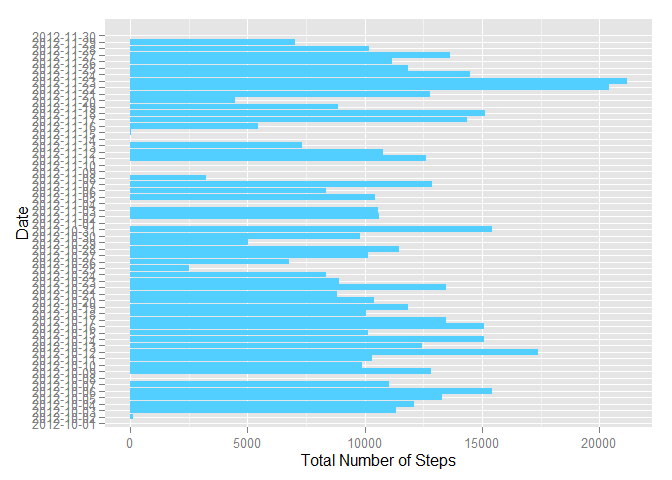
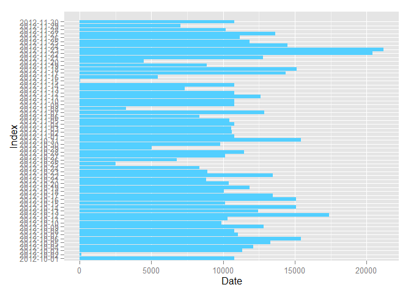
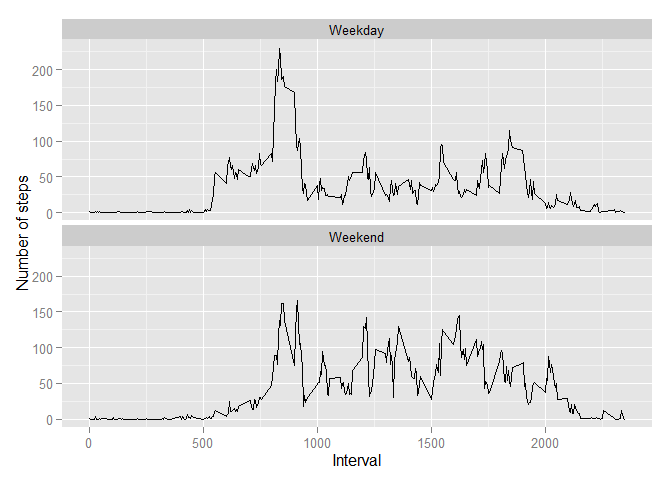

# Reproducible Research: Peer Assessment 1
Peter Cooman  
Thursday, June 11, 2015  

## Loading and preprocessing the data

```r
library(ggplot2)
data <- read.csv("activity.csv")
```

## What is the mean total number of steps taken per day?
We start by calculating the total number of steps for each day.


```r
data_per_day <- split(data$steps,data$date)
steps_per_day <- lapply(data_per_day,sum,na.rm = T)
steps_per_day <- cbind(unlist(steps_per_day))
steps_per_day <- data.frame(Date = row.names(steps_per_day), TotalNumSteps = steps_per_day, Index = c(1:nrow(steps_per_day)))
```

Plotting the histogram of the total number of steps for each day:


```r
p <- ggplot(steps_per_day, aes(x=Index, y=TotalNumSteps)) +
              geom_bar(stat="identity", fill="#53cfff") +
              coord_flip() +
              xlab("Date") +
              ylab("Total Number of Steps") +
              scale_x_discrete(breaks=steps_per_day$Index,labels=steps_per_day$Date)
print(p)
```

 

We can now calculate the mean and median values of TotalNumSteps over all days:

```r
meanSteps <- round((mean(steps_per_day$TotalNumSteps,na.rm=T)),digits=2)
medianSteps <- median(steps_per_day$TotalNumSteps,na.rm=T)
```

Mean = 9354.23 steps

Median = 10395 steps

## What is the average daily activity pattern?
We first average the number of steps over all days for each 5 minute interval.


```r
data_per_interval <- subset(data, select = c("steps","interval"))
data_per_interval <-  split(data$steps,data$interval)
mean_per_interval <- lapply(data_per_interval,mean,na.rm=T)
mean_per_interval <- cbind(unlist(mean_per_interval))
mean_per_interval <- data.frame(Interval = row.names(mean_per_interval), MeanSteps = mean_per_interval, Index = c(1:nrow(mean_per_interval)))
```

Plot the average number of steps for each 5 minute interval as a time series:


```r
p <- qplot(x=as.numeric(as.character(mean_per_interval$Interval)), y=MeanSteps, data=mean_per_interval, geom="line") +
            xlab("Interval") +
            ylab("Average Number of Steps")

print(p)
```

 

### Q: Which 5-minute interval, on average across all the days in the dataset, contains the maximum number of steps?

```r
x <- mean_per_interval$Interval[mean_per_interval$MeanSteps == max(mean_per_interval$MeanSteps)]
```

Answer:

Interval = 835

## Imputing missing values
Find the number of rows for which the number of steps is messing:


```r
y <- sum(is.na(data$steps))
```

There are 2304 values missing!

We will replace the missing data with the mean values per interval


```r
data_full <- data
z <- which(is.na(data$steps))
for (i in z) {
  data_full$steps[i] <- mean_per_interval$MeanSteps[mean_per_interval$Interval == data_full$interval[i]] 
  }
```


We now repeat the analysis for the new data set with all missing values filled in.

Total number of steps for each day:


```r
data_full_per_day <- split(data_full$steps,data_full$date)
steps_full_per_day <- lapply(data_full_per_day,sum,na.rm = T)
steps_full_per_day <- cbind(unlist(steps_full_per_day))
steps_full_per_day <- data.frame(Date = row.names(steps_full_per_day), TotalNumSteps = steps_full_per_day, Index = c(1:nrow(steps_full_per_day)))
```

Plotting the histogram of the total number of days after the missing values have been filled in:


```r
p <- ggplot(steps_full_per_day, aes(x=Index, y=TotalNumSteps)) +
              geom_bar(stat="identity", fill="#53cfff") +
              coord_flip() +
              ylab("Date") +
              scale_x_discrete(breaks=steps_full_per_day$Index,labels=steps_full_per_day$Date)
print(p)
```

 

The new mean and median of TotalNumSteps over all days are:

```r
meanStepsFull <- mean(steps_full_per_day$TotalNumSteps,na.rm=T)
medianStepsFull <- median(steps_full_per_day$TotalNumSteps,na.rm=T)
```

Mean2 = 10766.19 steps

Median2 = 10766.19 steps

The differences between the means and medians of the original and filled in data sets are:

```r
meanDiff <- meanStepsFull - meanSteps
medianDiff <- medianStepsFull - medianSteps
```

meanDiff = Mean2 - Mean1 = 10766.19 - 9354.23 = 1411.96

medianDiff = 371.1886792 = 10766.19 - 10395.00 = 371.19

### Q: What is the impact of imputing missing data on the estimates of the total daily number of steps? 
Answer: Adding in the missing data increased the mean and median values. This was to be expected since missing values did not contribute to the total number of steps (assumed = 0).

## Are there differences in activity patterns between weekdays and weekends?
Determine whether the observed date was a weekend day or a weekend day:


```r
data_full$date <- as.Date(data_full$date)
data_full$day <- weekdays(data_full$date)
data_full$type <- rep(0, times = nrow(data_full))
data_full$type[data_full$day == "Saturday" | data_full$day == "Sunday"] <- 1
data_full$type <- factor(data_full$type)
```

We can now divide the data according to Weekday or Weekend and again calculate the average number of steps for each 5 minute interval averaged over the observed days:

```r
data_full_per_interval <- subset(data_full, select = c("interval","type","steps"))
data_full_per_interval <-  split(data_full_per_interval$steps,list(data_full_per_interval$interval,data_full_per_interval$type))
mean_full_per_interval <- lapply(data_full_per_interval,mean,na.rm=T)
mean_full_per_interval <- cbind(read.table(text = names(mean_full_per_interval), sep = ".", colClasses = "character"),unlist(mean_full_per_interval))
names(mean_full_per_interval) <- c("interval","type","meanSteps")
mean_full_per_interval$type <- factor(mean_full_per_interval$type)
mean_full_per_interval$interval <- as.numeric(mean_full_per_interval$interval)
levels(mean_full_per_interval$type) <- c("Weekday","Weekend")
```

Making a panel plot of the average number of steps for each 5 minute interval, split according to Weekday or Weekend:


```r
p <- ggplot(mean_full_per_interval, aes(x=interval, y=meanSteps)) +
            geom_line(aes(x=interval, y=meanSteps)) +
            facet_wrap(~type, nrow = 2) +
            xlab("Interval") +
            ylab("Number of steps")
print(p)
```

 

### Q: Are there differences in activity patterns between weekdays and weekends?
There are some small differences, but overall the activity patterns for weekdays and weekend appear to be quite similar.
